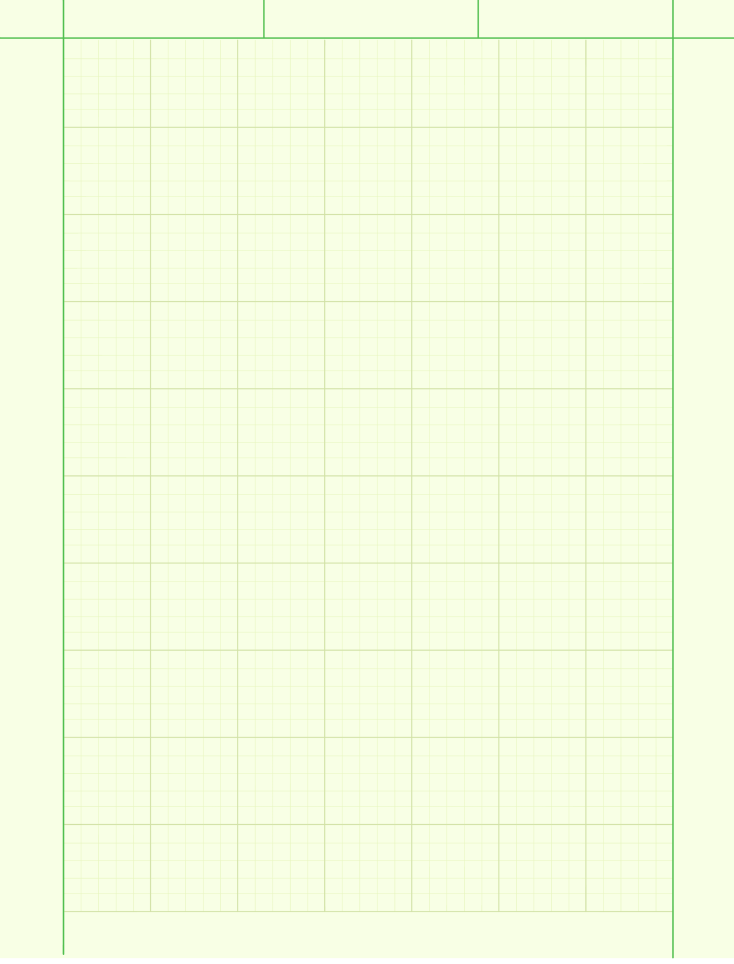
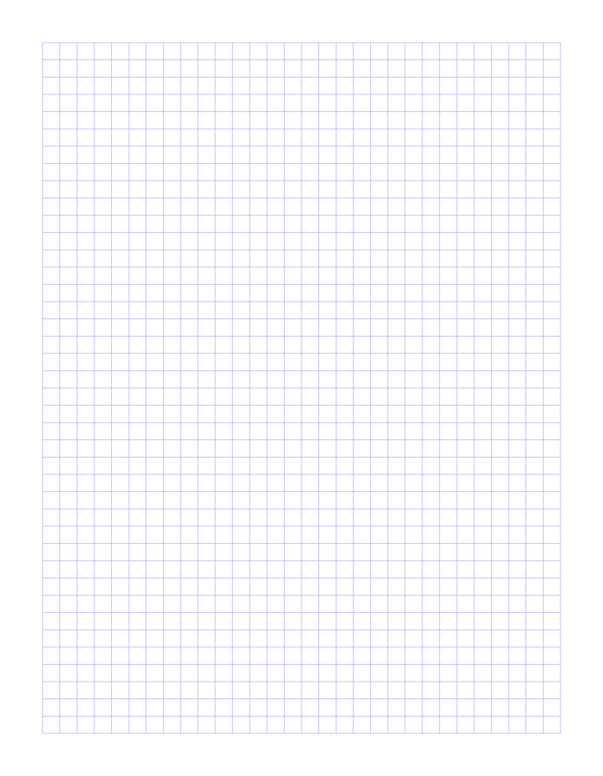

# excalidraw-templates
Templates I use for Obsidian's Excalidraw plugin.

If you have a suggestion, please feel free to make a pull request! Thank you!

## Lined Black

## Lined Blue

## Engineering

## Graph

